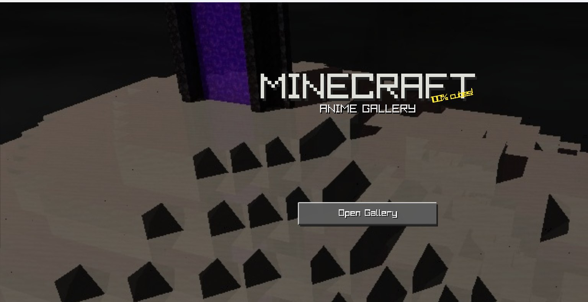
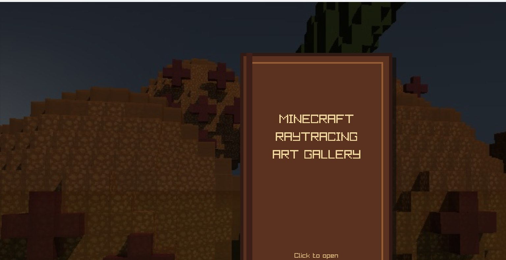
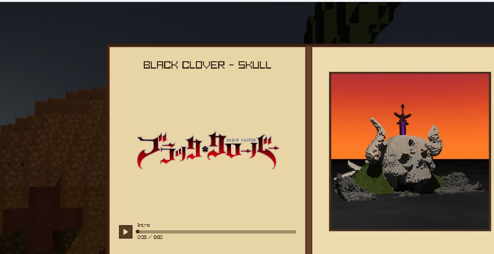
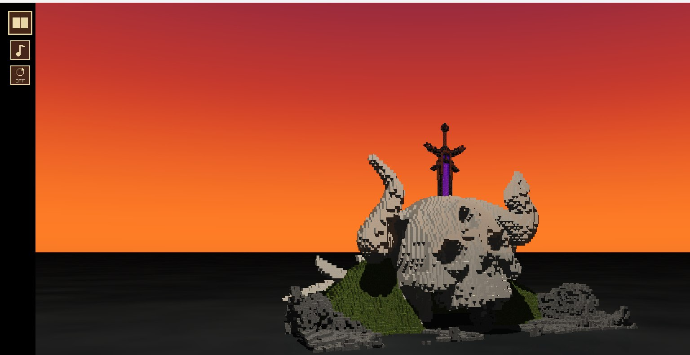
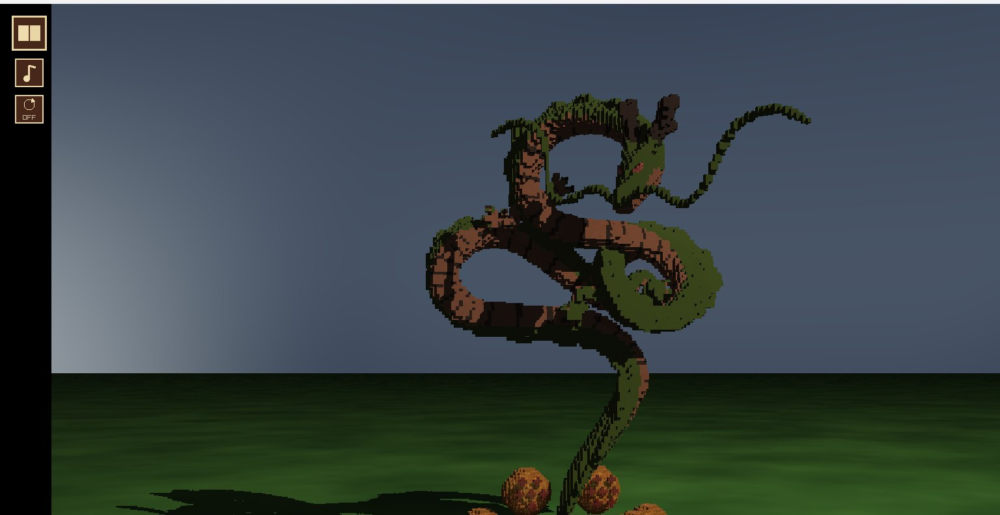
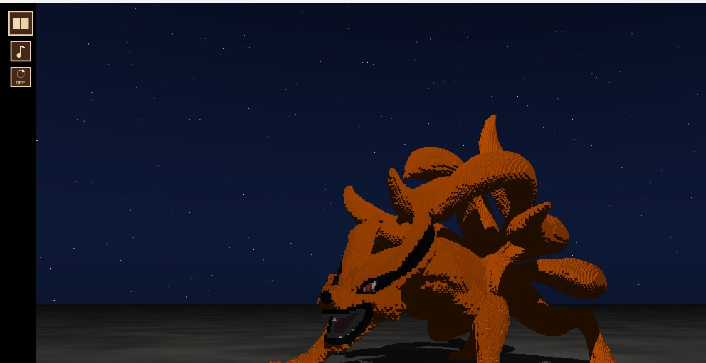
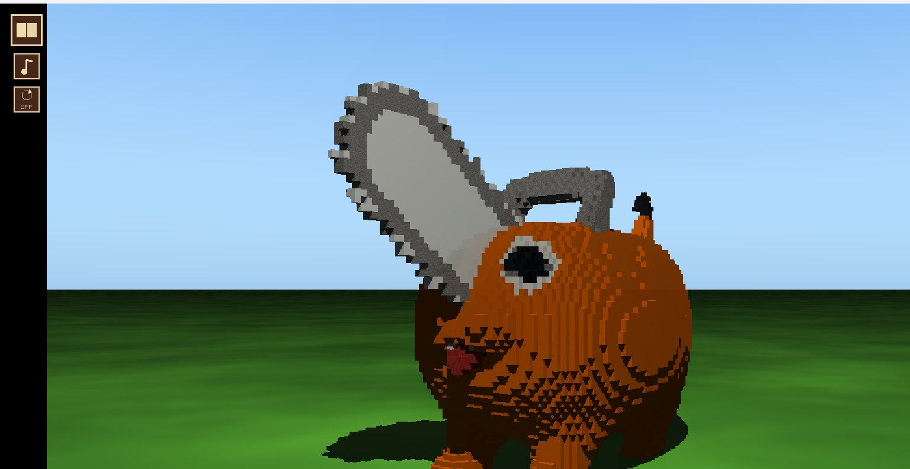
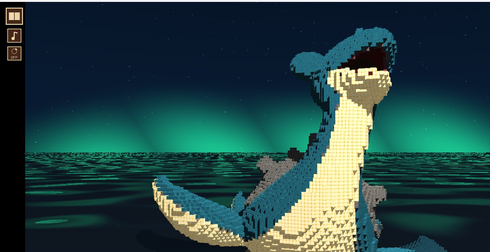

# Minecraft Anime Ray Tracing Gallery

Galería interactiva inspirada en Minecraft que presenta cinco dioramas de anime y videojuegos, renderizados por un ray tracer escrito en Rust.



## Video de demostración

[▶ Ver video oficial de demostración](https://youtu.be/C1D_3iuKePI?si=u9RPZei-fkfpCJHr)

## Experiencia de galería

La aplicación comienza con un menú animado, continúa con la portada de un libro y abre una galería navegable con logos, previews y un reproductor para la introducción de cada obra.

<p align="center">
  
  
</p>

El fondo del menú utiliza *sneak peeks* de las propias obras, renderizados previamente con el mismo ray tracer. En runtime se reproducen secuencias JPG precomputadas, lo que conserva el movimiento visual sin raytracear continuamente el fondo.

## Galería

Las imágenes siguientes muestran la cámara inicial real de cada diorama.

<table>
  <tr>
    <td width="50%" align="center">
      <strong>Black Clover</strong><br>
      <br>
      Atardecer, calavera monumental y Nether Portal animado y emisivo.
    </td>
    <td width="50%" align="center">
      <strong>Shenlong</strong><br>
      <br>
      Escena de tonos naturales bajo un cielo nublado y atmosférico.
    </td>
  </tr>
  <tr>
    <td width="50%" align="center">
      <strong>Kurama</strong><br>
      <br>
      Composición nocturna iluminada bajo un cielo estrellado.
    </td>
    <td width="50%" align="center">
      <strong>Pochita</strong><br>
      <br>
      Escena diurna de colores vivos, luz clara y sombras definidas.
    </td>
  </tr>
  <tr>
    <td colspan="2" align="center">
      <strong>Lapras</strong><br>
      <br>
      Noche con aurora y una superficie de agua con reflexión, transparencia y refracción.
    </td>
  </tr>
</table>

## Características

- **Render:** ray tracing en Rust, iluminación difusa Lambert y especular Phong, sombras mediante rayos, reflexión, refracción, transparencia y emisión.
- **Escenas:** texturas y materiales por bloque, cielos procedurales, suelos por obra, agua refractiva y un Nether Portal animado.
- **Interacción:** cámara orbital con pan y zoom, rotación automática opcional y dos niveles de calidad adaptados al movimiento.
- **Rendimiento:** BVH, render multithread, eliminación de bloques completamente encerrados y terminación de rayos secundarios con contribución despreciable.
- **Presentación:** cinco obras, libro interactivo, fondos precomputados animados, música ambiental de Minecraft e introducciones individuales.

## Cómo funciona el ray tracing

La cámara genera un rayo primario por píxel. Cada rayo busca la intersección más cercana con la geometría; el punto encontrado obtiene su material y textura, calcula iluminación Lambert y Phong y lanza rayos de sombra hacia la fuente de luz.

Cuando el material lo requiere, el trazado continúa recursivamente con rayos reflejados o refractados. El color resultante se escribe en el framebuffer. Un BVH acelera las búsquedas de intersección sin alterar el resultado visual.

## Optimización

La geometría opaca completamente encerrada se descarta al cargar la escena y los rayos se consultan mediante un BVH. El framebuffer se divide entre los hilos disponibles y las contribuciones secundarias insignificantes se detienen anticipadamente. Mientras la cámara se mueve se usa **Interactive Quality**; tras 200 ms de inactividad se genera **Final Quality**.

## Tecnologías

- **Rust** (edición 2024)
- **raylib-rs 5.5.1** para ventana, entrada, texturas, audio e interfaz
- **Python 3**, únicamente como herramienta auxiliar de preprocesamiento

Python no forma parte del ray tracer ni es necesario para ejecutar la aplicación. El script `tools/convert_schematic.py` se utilizó durante el desarrollo para convertir archivos Sponge/WorldEdit `.schem` al formato de escena de texto `.scene` consumido por el programa.

## Requisitos

- Rust y Cargo con soporte para la edición 2024.
- Un toolchain nativo de C/C++, CMake y libclang para compilar `raylib-sys` y ejecutar `bindgen`.
- Controladores con soporte de OpenGL y las bibliotecas de sistema requeridas por raylib para la plataforma utilizada.

No se necesita una instalación externa de raylib: Cargo gestiona `raylib-rs` y `raylib-sys` a partir de `Cargo.toml` y `Cargo.lock`.

## Instalación y ejecución

```bash
git clone https://github.com/xPat95/anime-raytracing-gallery.git
cd anime-raytracing-gallery
cargo run --release
```

Se recomienda `--release` porque el trazado de rayos es considerablemente más rápido con optimizaciones. No es necesario configurar `CARGO_TARGET_DIR` en una instalación normal.

## Controles

### Navegación

| Vista | Control | Acción |
|---|---|---|
| Menú principal | **Open Gallery** | Acceder a la portada |
| Portada | Clic en el libro | Abrir la galería |
| Portada | **Back** | Volver al menú principal |
| Galería | Flechas del teclado o botones laterales | Cambiar de obra |
| Galería | Clic en el preview | Abrir el diorama seleccionado |
| Galería | Botón **X** | Cerrar el libro |
| Galería | Reproductor | Reproducir, pausar o buscar en la introducción |

### Dioramas

| Control | Acción |
|---|---|
| Arrastrar con botón izquierdo / **WASD** | Orbitar la cámara |
| Arrastrar con botón derecho / flechas | Desplazar el target |
| Rueda del mouse | Acercar o alejar la cámara |
| **R** | Restaurar la cámara inicial |
| Botón del libro | Volver a la galería |
| Botón de música | Reproducir o pausar la introducción de la obra |
| Botón de rotación | Activar o desactivar la órbita automática |

La rotación automática no bloquea los controles manuales. Al abrir cualquier obra comienza desactivada.

## Assets y escenas

Los modelos originales se preprocesan al formato `.scene`, que contiene los bloques utilizados por la aplicación. Durante la carga se asocian geometrías, texturas y propiedades de material. Las cinco obras reutilizan el mismo ray tracer y se diferencian mediante sus configuraciones de cámara, entorno, suelo, iluminación y materiales.

El audio combina música ambiental de Minecraft con una introducción individual por obra. La interfaz permite controlar cada introducción sin sustituir los archivos ni incorporarlos al README.

## Estructura

```text
src/                  Ray tracer, cámara, BVH, escenas, audio e interfaz
assets/
  scenes/             Geometría preprocesada en formato .scene
  textures/           Texturas de bloques y materiales
  logos/              Logos utilizados por el libro
  previews/           Previews de selección
  audio/              Música ambiental e introducciones
  backgrounds/        Secuencias precomputadas del menú
  readme/             Capturas de esta documentación
tools/                 Conversor auxiliar de .schem a .scene
```

## Autor

Pablo Toledo
